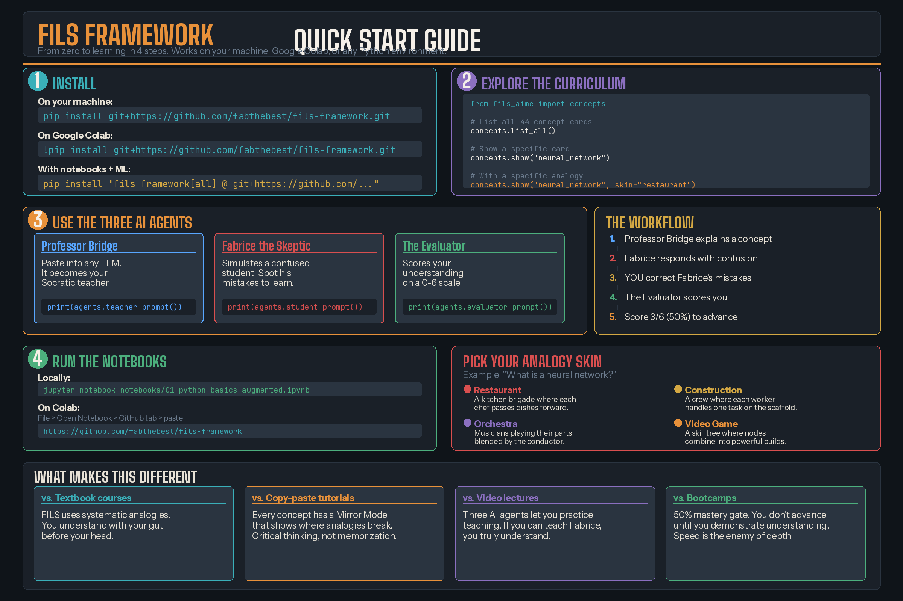

# FILS Framework - Usage Guide

A step-by-step guide to installing, using and contributing to the FILS Framework.



## Table of Contents

1. [Installation](#installation)
2. [Google Colab Setup](#google-colab-setup)
3. [Using the Python Library](#using-the-python-library)
4. [Reading Concept Cards](#reading-concept-cards)
5. [Using the AI Agents](#using-the-ai-agents)
6. [Running the Notebooks](#running-the-notebooks)
7. [The Learning Path](#the-learning-path)
8. [Verifying Code Safety](#verifying-code-safety)
9. [For Educators](#for-educators)
10. [Troubleshooting](#troubleshooting)

---

## Installation

### Option A: Install from GitHub (recommended)

```bash
pip install git+https://github.com/fabthebest/fils-framework.git
```

This installs the core library. For additional features:

```bash
# With Jupyter notebook support
pip install "fils-framework[notebooks] @ git+https://github.com/fabthebest/fils-framework.git"

# With machine learning libraries
pip install "fils-framework[ml] @ git+https://github.com/fabthebest/fils-framework.git"

# Everything included
pip install "fils-framework[all] @ git+https://github.com/fabthebest/fils-framework.git"
```

### Option B: Clone and install locally

```bash
git clone https://github.com/fabthebest/fils-framework.git
cd fils-framework
pip install -e .
```

The `-e` flag installs in editable mode so you can modify the files and see changes immediately.

### Verify the installation

```python
import fils
print(fils.__version__)  # Should print 0.1.0
```

---

## Google Colab Setup

Open a new Colab notebook and run this in the first cell:

```python
!pip install git+https://github.com/fabthebest/fils-framework.git
```

Then in the next cell:

```python
from fils import concepts, agents

# List everything available
concepts.list_all()
```

That is it. No API keys, no configuration, no account needed. The entire framework runs locally in the notebook.

### Colab Quick Start Notebook

Copy and paste this into a fresh Colab notebook to get started:

```python
# Cell 1: Install
!pip install git+https://github.com/fabthebest/fils-framework.git

# Cell 2: Explore the curriculum
from fils import concepts
for card in concepts.list_all():
    print(f"Card {card['number']:2d}: {card['title']} ({card['module']})")

# Cell 3: Read a specific concept
concepts.show("linear_regression")

# Cell 4: Read with a specific analogy skin
concepts.show("linear_regression", skin="restaurant")

# Cell 5: Load a teaching agent
from fils import agents
print(agents.teacher_prompt())
```

---

## Using the Python Library

The library has two main modules: `concepts` and `agents`.

### Concepts module

```python
from fils import concepts

# List all 6 learning modules
concepts.list_modules()
# Returns: [{'id': '01-python-basics', 'name': 'Python Basics', ...}, ...]

# List all 44 concept cards
concepts.list_all()
# Returns: [{'number': 1, 'title': 'Variables & Types', 'module': 'Python Basics'}, ...]

# Get a card by number
card = concepts.get_card(15)
print(card['title'])  # "Linear Regression"

# Get a card by name (partial match)
card = concepts.get_card("backpropagation")
print(card['content'])  # Full BRIDGIA card content

# Display a card in the terminal
concepts.show("tokenization")

# Display with a specific analogy highlighted
concepts.show("tokenization", skin="restaurant")
concepts.show("tokenization", skin="construction")
concepts.show("tokenization", skin="orchestra")
```

### Agents module

```python
from fils import agents

# List all available agents
agents.list_agents()
# Returns: [{'name': 'Professor Bridge', 'file': 'teacher.md', 'role': '...'}, ...]

# Get the teacher agent prompt
teacher = agents.teacher_prompt()

# Get the struggling student agent prompt
student = agents.student_prompt()

# Get the evaluator agent prompt
evaluator = agents.evaluator_prompt()
```

Each prompt is a complete system prompt ready to paste into any LLM (ChatGPT, Claude, Gemini, etc.).

---

## Reading Concept Cards

Every concept in the FILS Framework is structured as a BRIDGIA card with 7 sections:

| Section | What it contains |
|---------|-----------------|
| Hook | A one-sentence analogy that makes you curious |
| Mental Image | A vivid scenario you can picture |
| Decryption | The technical truth (the "nucleus") |
| Minimal Code | The shortest honest Python example |
| Analysis and Intuition | Why this matters and how to think about it |
| Traps and Limits | Common mistakes and where analogies break |
| Application | A mini-challenge to test your understanding |

Each card also includes multiple analogy "skins" so you can pick the one that makes sense to you:

| Skin | Best for someone who thinks in terms of... |
|------|---------------------------------------------|
| Restaurant | Kitchen work, cooking, recipes, food service |
| Construction | Building, architecture, physical labor |
| Orchestra | Music, performance, collaboration |
| City | Urban systems, neighborhoods, services |
| Video Game | Gaming, skill trees, quests, levels |
| Human Body | Biology, medicine, anatomy |

### Example: reading a card

```python
from fils import concepts

# Show the full card
concepts.show("neural_network")

# Same card, but highlighting the Restaurant analogy
concepts.show("neural_network", skin="restaurant")

# Same card, Video Game angle
concepts.show("neural_network", skin="video game")
```

---

## Using the AI Agents

The FILS Framework includes three AI agents that work together. You load their prompts and paste them into any LLM.

### Agent 1: Professor Bridge (the teacher)

Professor Bridge is a Socratic teacher who adapts explanations to your background using the PONT-IA 7-step method.

**How to use:**
1. Copy the prompt: `print(agents.teacher_prompt())`
2. Paste it as the system prompt in ChatGPT, Claude, or any LLM
3. Tell the agent your background (e.g., "I am a chef with no coding experience")
4. Ask it to teach you any concept (e.g., "Teach me what a neural network is")

The teacher will pick the analogy skin that matches your background and walk you through the concept step by step.

### Agent 2: Fabrice the Skeptic (the struggling student)

Fabrice is a simulated beginner who makes realistic mistakes. Your job is to spot the errors.

**How to use:**
1. Copy the prompt: `print(agents.student_prompt())`
2. Paste it into a second LLM instance
3. Feed it a concept explanation
4. Fabrice will respond with confused reasoning or flawed code
5. You identify what is wrong

This is the "gesture-based scoring" system: if you can teach Fabrice, you truly understand the concept.

### Agent 3: The Evaluator (the scorer)

The Evaluator is a neutral judge that scores comprehension on a 6-point scale.

**How to use:**
1. Copy the prompt: `print(agents.evaluator_prompt())`
2. Paste it into a third LLM instance
3. Feed it the conversation between teacher and student
4. It returns a score from 0 to 6 and a pass/fail decision

**Scoring rubric:**

| Points | What it measures |
|--------|-----------------|
| 1 | Can restate the definition simply |
| 2 | Understands the minimal code |
| 3 | Understands the main analogy |
| 4 | Knows where the analogy breaks (Mirror Mode) |
| 5 | Avoids the common mistake |
| 6 | Succeeds at a mini-application |

You need 3/6 (50%) to advance to the next concept. 4/6 means validated. 5/6 means you can contribute.

### Three-agent workflow

For the full experience, run all three agents:

1. Open three LLM sessions
2. Load Professor Bridge in session 1
3. Load Fabrice the Skeptic in session 2
4. Load The Evaluator in session 3
5. Have Professor Bridge explain a concept
6. Feed the explanation to Fabrice, who will respond with confusion
7. Try to correct Fabrice's mistakes yourself
8. Feed the entire exchange to The Evaluator for scoring

---

## Running the Notebooks

The `notebooks/` directory contains augmented Jupyter notebooks. These are not standard tutorials. Every code cell is annotated with a special notation:

```python
# [CORE] The technical truth, plain and direct.
# [ORBIT: Restaurant] The same idea explained through a kitchen analogy.
# [ORBIT: Construction] The same idea explained through a building analogy.
# [MIRROR] Where the analogy breaks down. Critical thinking moment.
# [TRAP] The most common mistake beginners make here.
```

### Running locally

```bash
cd fils-framework
pip install -e ".[notebooks]"
jupyter notebook notebooks/
```

### Running on Colab

1. Go to https://colab.research.google.com
2. File > Open Notebook > GitHub tab
3. Paste: `https://github.com/fabthebest/fils-framework`
4. Select the notebook you want to run
5. Run all cells

---

## The Learning Path

### Recommended order

Start with high-impact, low-difficulty concepts. Here is the suggested path:

**Phase 1: Python Foundations (Cards 1-7)**
Start here even if you have some Python experience. The BRIDGIA format will show you things you missed.

**Phase 2: Data and Pandas (Cards 8-13)**
Learn to manipulate data. This is where most real-world AI work begins.

**Phase 3: Machine Learning (Cards 14-23)**
The core algorithms. Linear regression, decision trees, random forests, and the critical concepts of overfitting and cross-validation.

**Phase 4: Deep Learning (Cards 24-30)**
Neural networks, backpropagation, CNNs, RNNs. The difficulty increases here.

**Phase 5: NLP and LLMs (Cards 31-37)**
Tokenization, embeddings, attention, transformers, fine-tuning, prompt engineering, RAG. This is the frontier.

**Phase 6: Statistics (Cards 38-44)**
Can be studied in parallel with any phase. Probability, hypothesis testing, Bayes' theorem.

### The 50% rule

Do not skip ahead. For each concept:

1. Read the BRIDGIA card
2. Pick the analogy skin that resonates with you
3. Run the notebook exercises
4. Take the mastery check (5 questions)
5. Score at least 3/6 (50%) before moving on

If you score below 50%, re-read the card with a different analogy skin and try again. The framework is designed so that switching skins often unlocks understanding.

---

## Verifying Code Safety

The FILS Framework is open source. You can and should verify that the code is safe before running it.

### What the code does

The entire Python library is 273 lines across 3 files. It does only two things:
1. Read Markdown files from the `modules/` and `agents/` directories
2. Print their contents to the screen

### What the code does NOT do

- No network requests (no internet access, no data sent anywhere)
- No file writing (nothing is modified on your computer)
- No data collection (no analytics, no tracking, no telemetry)
- No eval() or exec() (no dynamic code execution)
- No subprocess calls (no shell commands)
- No third-party dependencies at runtime (only `pyyaml` and standard library)

### How to verify yourself

**Read the source code (10 minutes):**
```bash
# The entire library is just 3 files
cat fils/__init__.py    # 33 lines, imports only
cat fils/agents.py      # 87 lines, reads .md files
cat fils/concepts.py    # 153 lines, parses .md files
```

**Run a security scan:**
```bash
pip install safety
safety check

pip install bandit
bandit -r fils/
```

**Check imports manually:**
```bash
grep -n "^import\|^from" fils/*.py
```

You should see only: `os`, `re`, `pathlib` (all standard library). No `requests`, no `urllib`, no `socket`, no `subprocess`.

**Check the notebook:**
Open `notebooks/01_python_basics_augmented.ipynb` in any text editor. It is a JSON file. Search for `requests`, `urllib`, `http`, `subprocess`, `eval`, `exec`. You should find none.

---

## For Educators

### Fork and customize

The Orbital Model means you can create new analogy skins without touching the technical content.

1. Fork the repository on GitHub
2. Open any concept card in `modules/`
3. Add a new `[ORBIT: YourSkin]` section under each analogy block
4. The technical nucleus stays the same

Example skins you could create: Sports, Farming, Fashion, Military, Music Production, Cooking for Kids.

### Use in a classroom

1. Install the library on student machines or use Colab
2. Have students pick their preferred analogy skin
3. Run the three-agent workflow as a group exercise:
   - One student plays Professor Bridge (explains)
   - Another student plays Fabrice (asks confused questions)
   - A third student plays The Evaluator (scores)
4. Rotate roles for each concept

### Create new concept cards

Use the template in `templates/concept-card-template.md` to create new cards following the BRIDGIA format.

---

## Troubleshooting

### "ModuleNotFoundError: No module named 'fils'"

The package is not installed. Run:
```bash
pip install git+https://github.com/fabthebest/fils-framework.git
```

### "Concept not found"

Use the exact card number or a substring of the title:
```python
concepts.get_card(15)                    # by number
concepts.get_card("linear_regression")   # partial title match
concepts.get_card("Linear")             # also works
```

### "Agent prompt not found"

Make sure the `agents/` directory exists in your installation. If you installed via pip, try cloning the repo instead:
```bash
git clone https://github.com/fabthebest/fils-framework.git
cd fils-framework
pip install -e .
```

### Notebook cells show errors

Install the notebook dependencies:
```bash
pip install "fils-framework[notebooks] @ git+https://github.com/fabthebest/fils-framework.git"
```

Or individually:
```bash
pip install jupyter pandas numpy matplotlib seaborn
```

### I want to contribute

See [CONTRIBUTING.md](CONTRIBUTING.md) for guidelines. The easiest contribution is adding a new analogy skin to an existing concept card.

---

*Built by Fabrice Fils-Aimé. FILS = Framework for Intuitive Learning Systems.*
