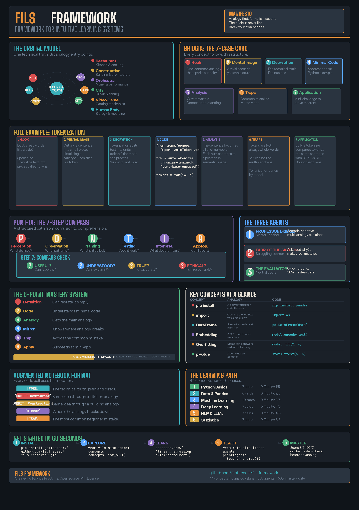

# FILS Framework

**Framework for Intuitive Learning Systems**

An open-source framework for making AI, ML, Python and statistics understandable through adaptive analogies, critical mirrors and mastery checks.

> "The FILS Framework does not ask beginners to adapt to jargon. It spins multiple analogy worlds around a technical nucleus until understanding appears."

---



---

## What is this?

The FILS Framework is not just another course — it is a **comprehension validation system**. It makes AI and data science genuinely understandable to anyone with no prior coding or math background by combining five interlocking components:

- **The Orbital Model** — A scalable analogy architecture where technical truth is the nucleus and interchangeable everyday analogies orbit around it like electrons
- **BRIDGIA** — A 7-case card system that structures every concept through analogy, code, intuition, and critical thinking
- **PONT-IA** — A 7-step learning compass with built-in ethical reasoning and mastery validation
- **Three AI Agents** — A Master Teacher that explains, a Struggling Student that stress-tests clarity, and an Evaluator that scores comprehension
- **The 50% Mastery Gate** — Gesture-based scoring where you prove understanding by spotting errors, not just answering quizzes

## Why another AI course?

Most AI courses fall into two traps: they're either too theoretical (textbook-style math) or too shallow (copy-paste tutorials). The FILS Framework solves this by building understanding through **systematic analogies** — not just one metaphor used once, but an entire architecture of interchangeable "skins" that meet learners where they are.

A chef understands AI through kitchen operations. A construction worker through building sites. A musician through orchestras. The technical truth stays the same — the entry point adapts.

## The Analogy Skins

Every concept in this course can be explained through 6+ analogy systems:

| Skin | Domain | Example: "What is a neural network?" |
|------|--------|--------------------------------------|
| Restaurant | Kitchen & cooking | A kitchen brigade where each chef (neuron) has a specialty, passes dishes forward, and the head chef (output layer) assembles the final plate |
| Construction | Building & architecture | A construction crew where each worker handles one task, passes materials up the scaffolding, and the foreman inspects the final structure |
| Orchestra | Music & performance | An orchestra where each musician plays their part, the sections blend together, and the conductor shapes the final symphony |
| City | Urban planning | A city where neighborhoods process different services, roads carry information between them, and city hall makes final decisions |
| Video Game | Gaming mechanics | A skill tree where each node unlocks abilities, paths combine into builds, and the final boss fight tests everything together |
| Human Body | Biology & medicine | A nervous system where sensory neurons detect inputs, interneurons process signals through layers, and motor neurons produce the response |

## Course Structure

### Phase 1: Python Foundations
| # | Concept | Difficulty | Impact |
|---|---------|-----------|--------|
| 1 | Variables & Types | 1/5 | 5/5 |
| 2 | Lists & Dictionaries | 2/5 | 5/5 |
| 3 | Loops & Conditions | 2/5 | 5/5 |
| 4 | Functions | 2/5 | 5/5 |
| 5 | Classes & Objects | 3/5 | 4/5 |
| 6 | File I/O | 2/5 | 3/5 |
| 7 | Error Handling | 2/5 | 4/5 |

### Phase 2: Data & Pandas
| # | Concept | Difficulty | Impact |
|---|---------|-----------|--------|
| 8 | DataFrames | 2/5 | 5/5 |
| 9 | Filtering & Selection | 2/5 | 5/5 |
| 10 | GroupBy & Aggregation | 3/5 | 5/5 |
| 11 | Merge & Join | 3/5 | 4/5 |
| 12 | Data Cleaning | 3/5 | 5/5 |
| 13 | Visualization (Matplotlib/Seaborn) | 2/5 | 4/5 |

### Phase 3: Machine Learning
| # | Concept | Difficulty | Impact |
|---|---------|-----------|--------|
| 14 | Train/Test Split | 2/5 | 5/5 |
| 15 | Linear Regression | 3/5 | 5/5 |
| 16 | Logistic Regression | 3/5 | 5/5 |
| 17 | Decision Trees | 2/5 | 5/5 |
| 18 | Random Forest | 3/5 | 5/5 |
| 19 | k-Nearest Neighbors | 2/5 | 4/5 |
| 20 | SVM | 4/5 | 3/5 |
| 21 | Overfitting & Regularization | 3/5 | 5/5 |
| 22 | Cross-Validation | 3/5 | 5/5 |
| 23 | Feature Engineering | 3/5 | 5/5 |

### Phase 4: Deep Learning
| # | Concept | Difficulty | Impact |
|---|---------|-----------|--------|
| 24 | Neurons & Perceptrons | 3/5 | 5/5 |
| 25 | Neural Network Architecture | 4/5 | 5/5 |
| 26 | Backpropagation | 4/5 | 5/5 |
| 27 | CNNs (Convolutional Networks) | 4/5 | 5/5 |
| 28 | RNNs & LSTMs | 4/5 | 4/5 |
| 29 | Transfer Learning | 3/5 | 5/5 |
| 30 | GANs | 5/5 | 4/5 |

### Phase 5: NLP & LLMs
| # | Concept | Difficulty | Impact |
|---|---------|-----------|--------|
| 31 | Tokenization | 2/5 | 5/5 |
| 32 | Word Embeddings | 3/5 | 5/5 |
| 33 | Attention Mechanism | 4/5 | 5/5 |
| 34 | Transformers | 5/5 | 5/5 |
| 35 | Fine-Tuning | 3/5 | 5/5 |
| 36 | Prompt Engineering | 2/5 | 5/5 |
| 37 | RAG (Retrieval-Augmented Generation) | 4/5 | 5/5 |

### Phase 6: Statistics
| # | Concept | Difficulty | Impact |
|---|---------|-----------|--------|
| 38 | Mean, Median, Mode | 1/5 | 5/5 |
| 39 | Standard Deviation & Variance | 2/5 | 5/5 |
| 40 | Probability Distributions | 3/5 | 5/5 |
| 41 | Hypothesis Testing | 4/5 | 4/5 |
| 42 | Correlation vs Causation | 2/5 | 5/5 |
| 43 | Bayes' Theorem | 4/5 | 5/5 |
| 44 | Sampling & Bias | 3/5 | 5/5 |

## How to Use This Course

### Self-Study Path
1. Read the concept card (BRIDGIA format) in the `modules/` folder
2. Pick the analogy skin that resonates with you
3. Run the Jupyter notebook in `notebooks/`
4. Use the PONT-IA compass to check your understanding
5. Pass the mastery check (50% minimum) before moving on

### With the AI Agents (the secret weapon)
- **Professor Bridge** (`agents/teacher.md`) — Load this prompt into any LLM for Socratic, adaptive teaching that matches your pace
- **Fabrice the Skeptic** (`agents/student.md`) — A simulated struggling learner who makes real beginner mistakes. Fabrice will propose flawed code or reasoning — your job is to spot the error. If you can teach Fabrice, you truly understand
- **The Evaluator** (`agents/evaluator.md`) — A neutral scoring agent that rates comprehension on a 6-point scale and decides whether you can advance

### For Educators
Fork this repo and adapt the analogy skins to your audience. The orbital model means you can create new skins (sports, farming, fashion, military) without changing any technical content.

## Repository Structure

```
fils-framework/
├── README.md                          # You are here
├── LICENSE                            # MIT License
├── CONTRIBUTING.md                    # How to contribute
├── requirements.txt                   # Python dependencies
├── frameworks/
│   ├── bridgia/                       # The 7-case card system
│   ├── pontia/                        # The 7-step compass
│   └── orbital/                       # The orbital analogy model
├── modules/
│   ├── 01-python-basics/              # Phase 1: 7 concept cards
│   ├── 02-data-pandas/                # Phase 2: 6 concept cards
│   ├── 03-machine-learning/           # Phase 3: 10 concept cards
│   ├── 04-deep-learning/              # Phase 4: 7 concept cards
│   ├── 05-nlp-llms/                   # Phase 5: 7 concept cards
│   └── 06-statistics/                 # Phase 6: 7 concept cards
├── notebooks/                         # Augmented Jupyter notebooks
│   └── 01_python_basics_augmented.ipynb
├── agents/
│   ├── teacher.md                     # Professor Bridge prompt
│   ├── student.md                     # Fabrice the Skeptic prompt
│   └── evaluator.md                   # The Evaluator prompt
├── docs/
│   ├── confusion-library.md           # 15 most common beginner confusions
│   └── mastery-protocol.md            # The 50% mastery gate system
├── templates/
│   └── concept-card-template.md       # Blank BRIDGIA card for contributors
└── assets/                            # Images, diagrams
```

## The Mastery System

Understanding is not binary. The FILS Framework uses a 6-point scoring system:

| Point | What it measures |
|-------|-----------------|
| 1 | Can restate the definition simply |
| 2 | Understands the minimal code |
| 3 | Understands the main analogy |
| 4 | Knows where the analogy breaks (Mirror Mode) |
| 5 | Avoids the common mistake |
| 6 | Succeeds at a mini-application |

Mastery tiers: 3/6 (50%) = can continue cautiously. 4/6 = validated beginner. 5/6 = can contribute to the project. 6/6 = solid mastery.

The key innovation: mastery is measured through **gesture-based scoring**. Fabrice the Skeptic (the struggling student agent) proposes flawed code or reasoning. You earn points by identifying what's wrong — not by memorizing answers.

See [docs/mastery-protocol.md](docs/mastery-protocol.md) for the full protocol and [docs/confusion-library.md](docs/confusion-library.md) for the 15 most common beginner confusions.

## Augmented Notebooks

The Jupyter notebooks in this project are not standard tutorials. Every code cell is annotated with orbital notation:

```python
# [CORE] import makes a library available in the current session.
# [ORBIT: Restaurant] Take the Pandas robot out of the cupboard and put it on the counter.
# [ORBIT: Construction] Bring a specialized machine to the job site.
# [MIRROR] import does NOT install pandas. It only loads it. If pandas is not installed, you get an error.
# [TRAP] pip install and import are two different actions. Install once, import every session.
import pandas as pd
```

This is what makes the notebooks different from every other AI tutorial: you see the technical truth, the analogy, its limits, and the common trap — all in one glance.

## The Rating System

Every concept is rated on two axes:

- **Difficulty** (1-5): How hard is this to understand from scratch?
- **Impact** (1-5): How much does mastering this concept unlock?

Start with high-impact, low-difficulty concepts. That's where you get the fastest return on your learning investment.

## Philosophy

The FILS Framework is built on five principles:

1. **Analogy First, Formalism Second** — You understand with your gut before your head. Every concept starts with a story.
2. **The Nucleus Never Lies** — Analogies are bridges, not destinations. The technical truth (the nucleus) is always preserved and explicitly stated.
3. **Break Your Own Bridges** — Every analogy card includes a "Mirror Mode" section that shows where the analogy fails. This builds critical thinking.
4. **Mastery Before Motion** — You don't advance until you demonstrate 50% understanding. Speed is the enemy of depth.
5. **Ethics Built In** — Every concept card asks "Is this ethical?" through the PONT-IA compass. AI education without ethics education is irresponsible.

## Current Status

**Version: 0.1.0-alpha**

This is an early release. The framework is functional but evolving.

| Component | Status |
|-----------|--------|
| 44 BRIDGIA concept cards (6 modules) | Implemented |
| Python library (`from fils import concepts, agents`) | Implemented |
| 3 AI agent prompts (Teacher, Student, Evaluator) | Implemented |
| 1 augmented Jupyter notebook (Python Basics) | Implemented |
| Confusion library (15 entrie